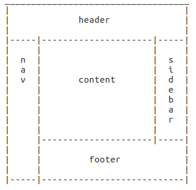

# c-sats project

## Hash Application Problem

**NOTE: requires Node v10.4 or greater due to BigNum**

**Requirements**:

Find a 9 letter string of characters that contains only letters from

acdefgilnoprstuw
such that the hash(the_string) is

934605031880300
if hash is defined by the following pseudo-code:

      Int64 hash(String s) {
        Int64 h = 7
        String letters = "acdefgilnoprstuw"
        for (Int32 i = 0; i < s.length; i++) {
          h = h * 37 + letters.indexOf(s[i])
        }
        return h
      }
For example, if we were trying to find the 7 letter string where hash(the_string) was 677842960118, the answer would be "gleeful".

In addition, find an 11-letter string of characters such that hash(the_string) is 1317985395605002507.

**To run**:

```bash
cd ./hash
npm i
node index.js -c7 677842960118            # => gleeful
node index.js -c9 934605031880300         # => leapfrogs
node index.js -c11 1317985395605002507    # => (no valid input string found)

# run tests
npm run test
```

**Solution**:

The hash is predictable, where changing a letter from a -> c, c -> d, etc. makes the resulting hash larger. This starts with the minimal possible input (for a 7 char input, `aaaaaaa`) and increases the first letter until it's too large, then repeats with each subsequent letter until the resulting input matches or is too large and returns an error.

---

## Web Design Application Problem
Build a basic web page that contains the following five content areas. Layout is as follows:



**Requirements**:

- The layout occupies the whole page at a minimum
- The layout should scale vertically as content grows
- The layout should responsively adapt to small screens by stacking the content vertically as follows:
  1. header
  1. nav
  1. sidebar
  1. content
  1. footer

**To run**:

```bash
cd ./design
npm i
npm run dev
```

**Solution**:

Basically nested flexboxes. They can stretch to fill up a page and are easy to switch over to a more basic column layout in narrow formats (in this case, anything 480px and below, so most phones in a held as portrait).

Since this was a basic layout challenge I just stuck with vanilla HTML 5 & CSS 3 and will work in most recent browsers as-is, but depending on the final requirements it would be easier to use something like SCSS to nest rules, autoprefixer to prefix and/or change to the older flexbox spec for wider compat, and potentially add a flexbox JS polyfill if we really needed to support old browsers and the basic layout wasn't good enough.